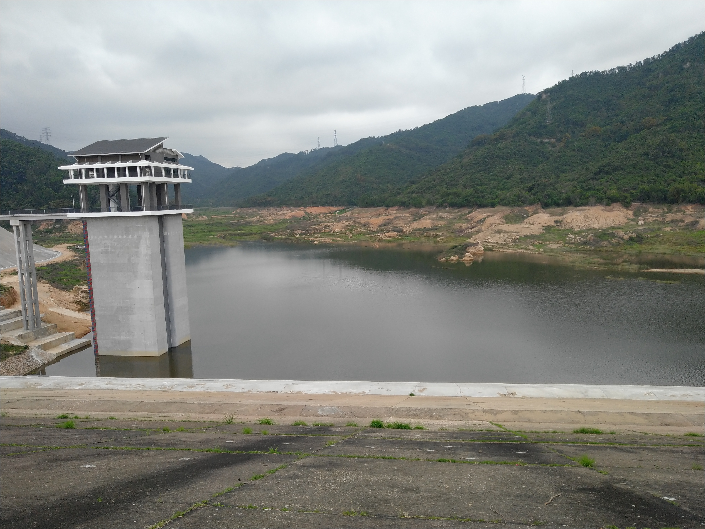
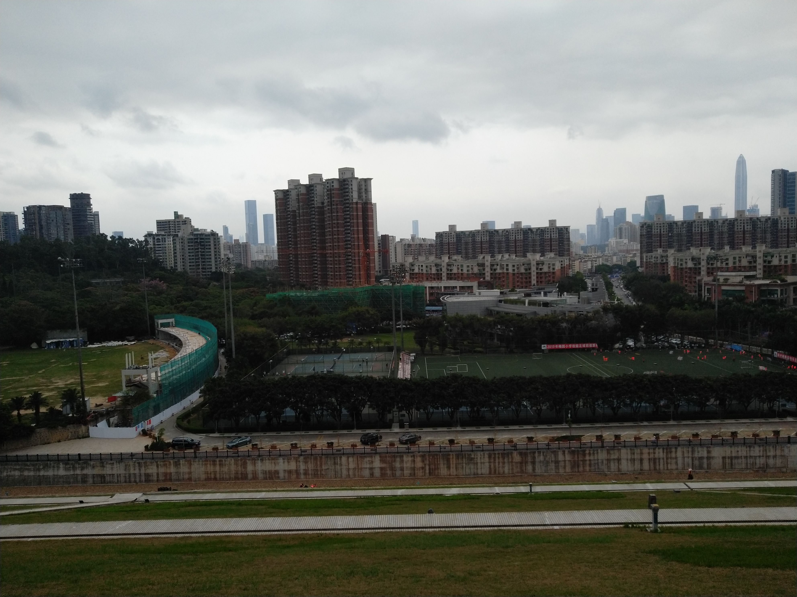
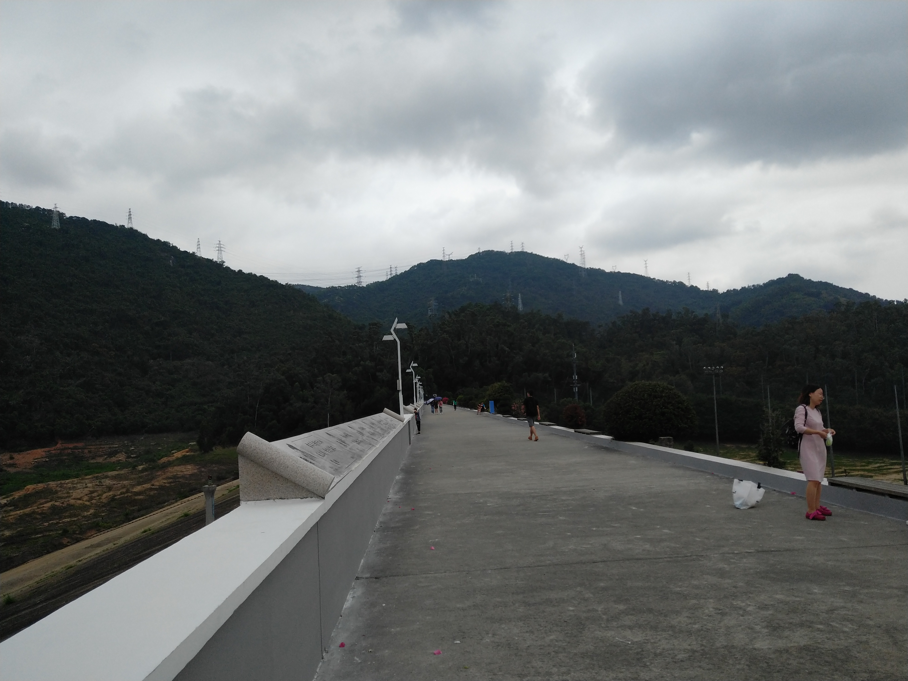
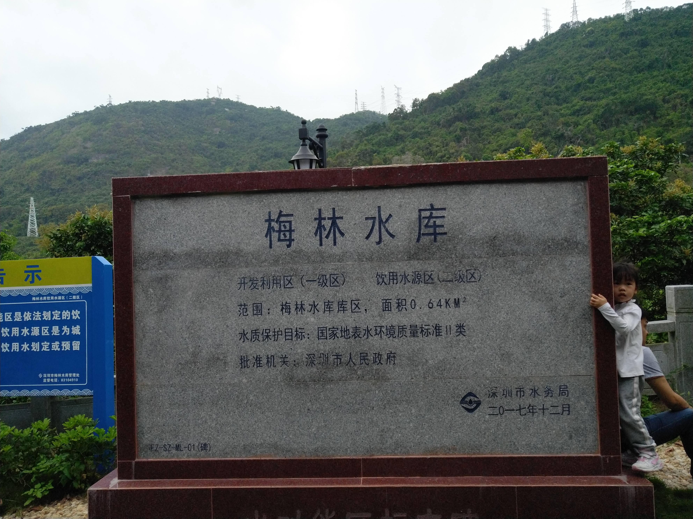
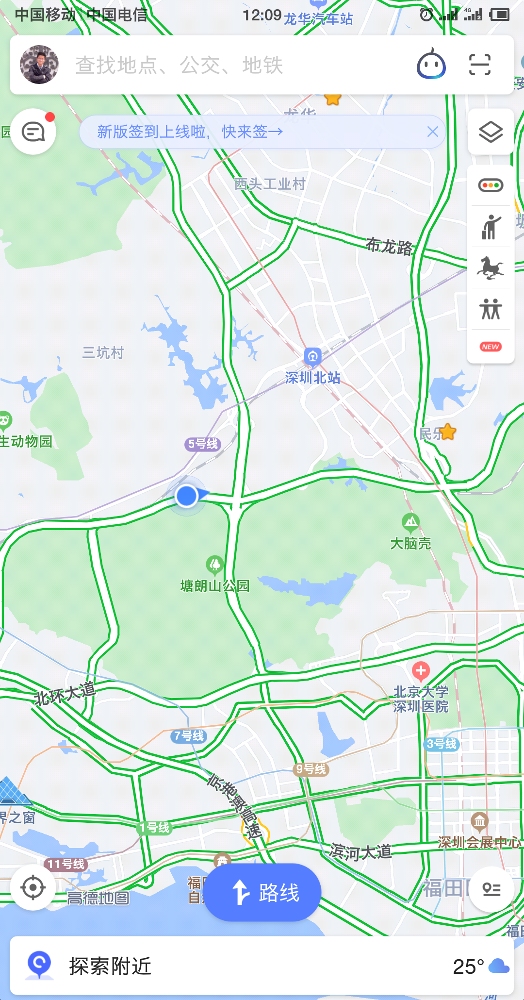

虽然在深圳好些年了，但是我不喜欢出去，所以很多地方都没有去过。

在有需要接待朋友的时候，就会有些麻烦，不知道哪些地方适合带朋友去。

所以，我决定还是自己把相关的景点都走一遍，这样心里有底一些。

也是给自己一个机会，出去走走。

我个人生性是喜欢水的，一大片湖泊，是我的最爱。但是深圳似乎并没有大面积的水域。

有几个水库。不过大多不让进去的。

深圳的自然风景，我就按照：水、山、海。按照这个思路走一遍吧。

# 水

深圳有这些水库

```
西丽水库
	西丽果场：可以摘荔枝。
铁岗水库
	深圳最大的水库。
	不让进的，只能远观。
石岩水库
	有度假村。
梅林水库
	不大。可以进去。附近是塘朗山绿道。
深圳水库
	进是不让进，但是附近有个公园。环境不错。
```

深圳大大小小的水库有100个左右。

很多水库处于保护水源安全的目的，是不让人靠近的。

下面就按照我实际看到的情况罗列吧。


## 梅林水库

交通方式：

在下梅林地铁站D出口出来，走几百米就到了。可以随意进入的。

水库是这样子。



下面是一个足球场。附近是小区。住在这里应该挺舒服的吧。



如上面的图可见，水库不大，大了也就很重要了，重要了就不会让你靠近了。哎，真是矛盾呀。

水库旁边的护栏比较高，可以保证安全。有跑道。有人跑步。护栏上刻了不少的诗句。



沿着这个跑道走到头，就是一个保安门，是进入到绿道的，就是塘朗山绿道。非常适合徒步，长度够长。路很好走。人不少。

绿道基本是这个样子。


沿着一直走就是了，没有弯路。走到头，就到了塘朗地铁站附近了。这边没有什么吃饭的地方，其实从这么出发，最后到水库结束，这种路线可能更加合理。大概要走一个多小时吧。

路上看到一块石碑，刻着水库的信息。



走到头的地图位置在这里。



##长岭陂水库

因为我从梅林水库绿道走出来，就到这个水库附近了，所以顺便过来看看。

果然是不让进去的。


还是做遵纪守法的好公民，不进去了。


 

